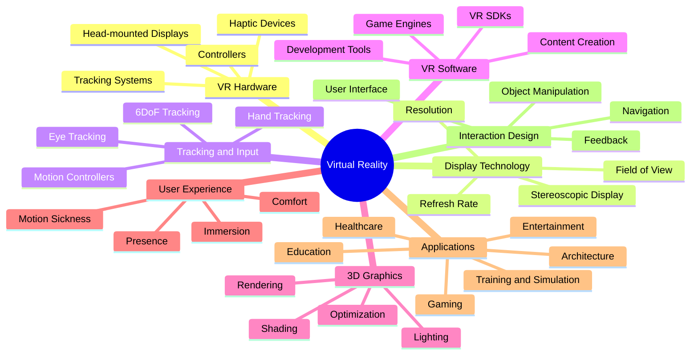

```mermaid
mindmap
  root((Virtual Reality))
    VR Hardware
      Head-mounted Displays
      Controllers
      Tracking Systems
      Haptic Devices
    Display Technology
      Resolution
      Field of View
      Refresh Rate
      Stereoscopic Display
    Tracking and Input
      6DoF Tracking
      Hand Tracking
      Eye Tracking
      Motion Controllers
    VR Software
      Game Engines
      VR SDKs
      Development Tools
      Content Creation
    3D Graphics
      Rendering
      Shading
      Lighting
      Optimization
    User Experience
      Immersion
      Presence
      Comfort
      Motion Sickness
    Applications
      Gaming
      Training and Simulation
      Education
      Healthcare
      Architecture
      Entertainment
    Interaction Design
      User Interface
      Navigation
      Object Manipulation
      Feedback
```

