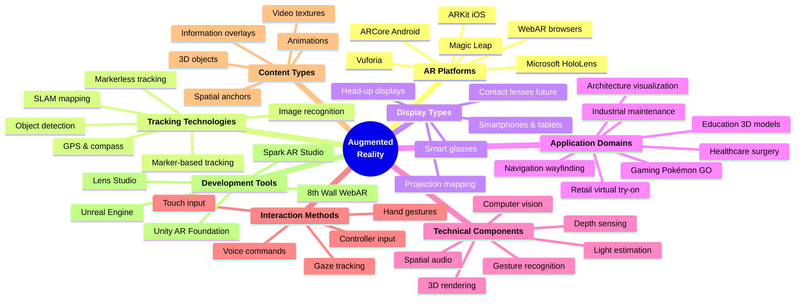

```mermaid
mindmap
  root((<b>Augmented<br>Reality</b>))
    <b>AR Platforms</b>
      ARKit iOS
      ARCore Android
      Microsoft HoloLens
      Magic Leap
      WebAR browsers
      Vuforia
    <b>Tracking Technologies</b>
      Marker-based tracking
      Markerless tracking
      SLAM mapping
      GPS & compass
      Image recognition
      Object detection
    <b>Display Types</b>
      Smartphones & tablets
      Smart glasses
      Head-up displays
      Contact lenses future
      Projection mapping
    <b>Application Domains</b>
      Retail virtual try-on
      Navigation wayfinding
      Gaming Pokémon GO
      Education 3D models
      Industrial maintenance
      Healthcare surgery
      Architecture visualization
    <b>Technical Components</b>
      Computer vision
      3D rendering
      Spatial audio
      Gesture recognition
      Depth sensing
      Light estimation
    <b>Interaction Methods</b>
      Touch input
      Hand gestures
      Voice commands
      Gaze tracking
      Controller input
    <b>Content Types</b>
      3D objects
      Information overlays
      Animations
      Video textures
      Spatial anchors
    <b>Development Tools</b>
      Unity AR Foundation
      Unreal Engine
      8th Wall WebAR
      Spark AR Studio
      Lens Studio
```

