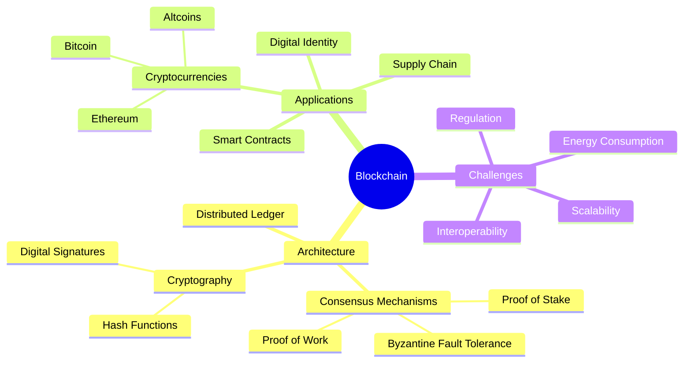

```mermaid
mindmap
  root((Blockchain))
    Architecture
      Distributed Ledger
      Consensus Mechanisms
        Proof of Work
        Proof of Stake
        Byzantine Fault Tolerance
      Cryptography
        Hash Functions
        Digital Signatures
    Applications
      Cryptocurrencies
        Bitcoin
        Ethereum
        Altcoins
      Smart Contracts
      Supply Chain
      Digital Identity
    Challenges
      Scalability
      Energy Consumption
      Regulation
      Interoperability
```

