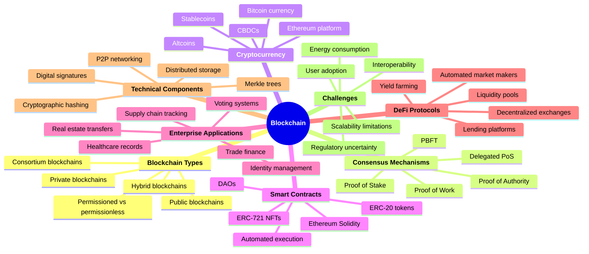

```mermaid
mindmap
  root((<b>Blockchain</b>))
    <b>Blockchain Types</b>
      Public blockchains
      Private blockchains
      Consortium blockchains
      Hybrid blockchains
      Permissioned vs permissionless
    <b>Consensus Mechanisms</b>
      Proof of Work
      Proof of Stake
      Delegated PoS
      PBFT
      Proof of Authority
    <b>Cryptocurrency</b>
      Bitcoin currency
      Ethereum platform
      Stablecoins
      CBDCs
      Altcoins
    <b>Smart Contracts</b>
      Ethereum Solidity
      DAOs
      ERC-20 tokens
      ERC-721 NFTs
      Automated execution
    <b>Enterprise Applications</b>
      Supply chain tracking
      Healthcare records
      Identity management
      Voting systems
      Real estate transfers
      Trade finance
    <b>DeFi Protocols</b>
      Decentralized exchanges
      Lending platforms
      Yield farming
      Liquidity pools
      Automated market makers
    <b>Technical Components</b>
      Cryptographic hashing
      Digital signatures
      Merkle trees
      Distributed storage
      P2P networking
    <b>Challenges</b>
      Scalability limitations
      Energy consumption
      Regulatory uncertainty
      Interoperability
      User adoption
```

