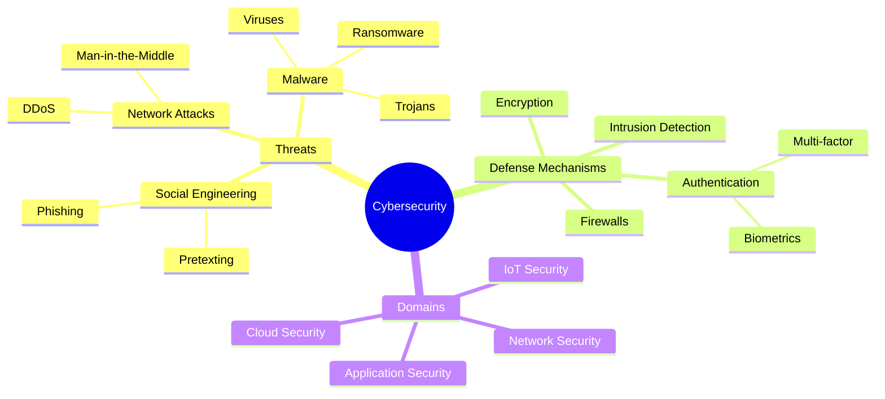

```mermaid
mindmap
  root((Cybersecurity))
    Threats
      Malware
        Viruses
        Ransomware
        Trojans
      Social Engineering
        Phishing
        Pretexting
      Network Attacks
        DDoS
        Man-in-the-Middle
    Defense Mechanisms
      Encryption
      Firewalls
      Intrusion Detection
      Authentication
        Multi-factor
        Biometrics
    Domains
      Network Security
      Application Security
      Cloud Security
      IoT Security
```

