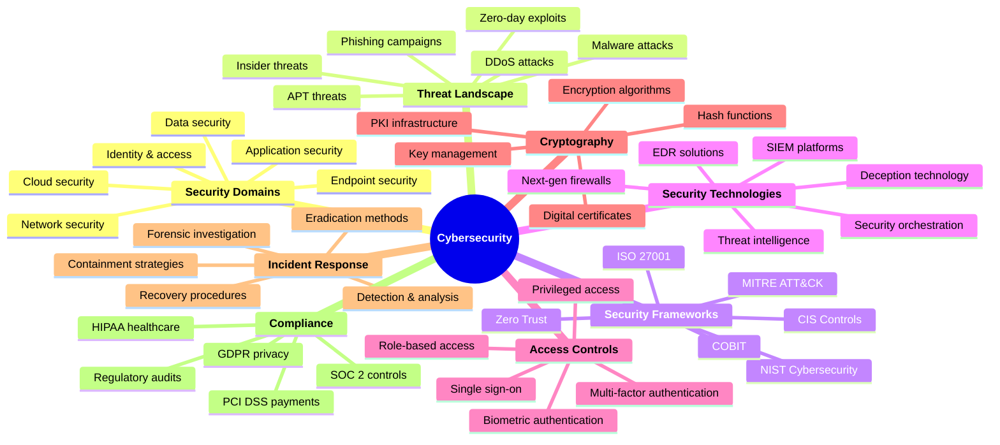

```mermaid
mindmap
  root((<b>Cybersecurity</b>))
    <b>Security Domains</b>
      Network security
      Application security
      Endpoint security
      Cloud security
      Identity & access
      Data security
    <b>Threat Landscape</b>
      Malware attacks
      Phishing campaigns
      APT threats
      Insider threats
      DDoS attacks
      Zero-day exploits
    <b>Security Frameworks</b>
      NIST Cybersecurity
      ISO 27001
      CIS Controls
      MITRE ATT&CK
      Zero Trust
      COBIT
    <b>Security Technologies</b>
      Next-gen firewalls
      SIEM platforms
      EDR solutions
      Security orchestration
      Threat intelligence
      Deception technology
    <b>Access Controls</b>
      Multi-factor authentication
      Single sign-on
      Privileged access
      Role-based access
      Biometric authentication
    <b>Cryptography</b>
      Encryption algorithms
      PKI infrastructure
      Digital certificates
      Hash functions
      Key management
    <b>Incident Response</b>
      Detection & analysis
      Containment strategies
      Eradication methods
      Recovery procedures
      Forensic investigation
    <b>Compliance</b>
      GDPR privacy
      HIPAA healthcare
      PCI DSS payments
      SOC 2 controls
      Regulatory audits
```

