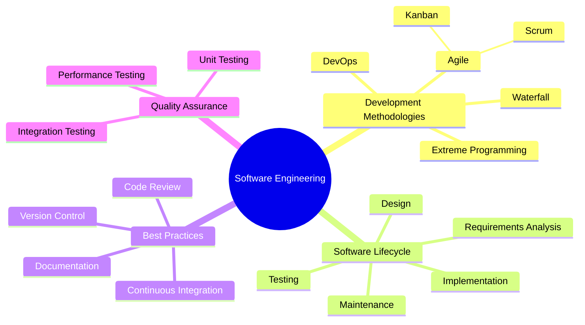

```mermaid
mindmap
  root((Software Engineering))
    Development Methodologies
      Agile
        Scrum
        Kanban
      Waterfall
      DevOps
      Extreme Programming
    Software Lifecycle
      Requirements Analysis
      Design
      Implementation
      Testing
      Maintenance
    Best Practices
      Version Control
      Code Review
      Documentation
      Continuous Integration
    Quality Assurance
      Unit Testing
      Integration Testing
      Performance Testing
```

