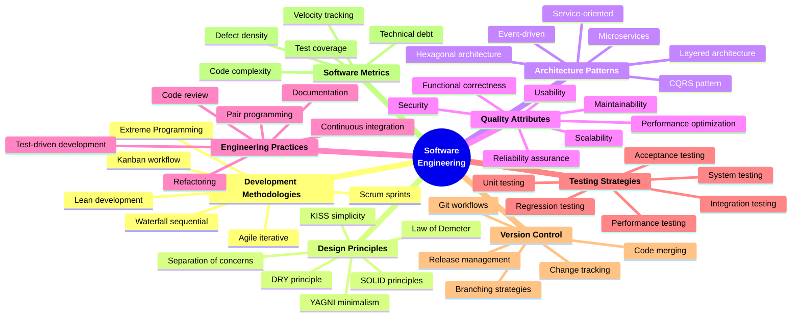

```mermaid
mindmap
  root((<b>Software<br>Engineering</b>))
    <b>Development Methodologies</b>
      Waterfall sequential
      Agile iterative
      Scrum sprints
      Extreme Programming
      Kanban workflow
      Lean development
    <b>Design Principles</b>
      SOLID principles
      Separation of concerns
      DRY principle
      KISS simplicity
      YAGNI minimalism
      Law of Demeter
    <b>Architecture Patterns</b>
      Layered architecture
      Microservices
      Event-driven
      Service-oriented
      Hexagonal architecture
      CQRS pattern
    <b>Quality Attributes</b>
      Functional correctness
      Performance optimization
      Reliability assurance
      Maintainability
      Scalability
      Security
      Usability
    <b>Engineering Practices</b>
      Code review
      Continuous integration
      Test-driven development
      Refactoring
      Pair programming
      Documentation
    <b>Testing Strategies</b>
      Unit testing
      Integration testing
      System testing
      Acceptance testing
      Regression testing
      Performance testing
    <b>Version Control</b>
      Git workflows
      Branching strategies
      Code merging
      Release management
      Change tracking
    <b>Software Metrics</b>
      Code complexity
      Test coverage
      Defect density
      Technical debt
      Velocity tracking
```

