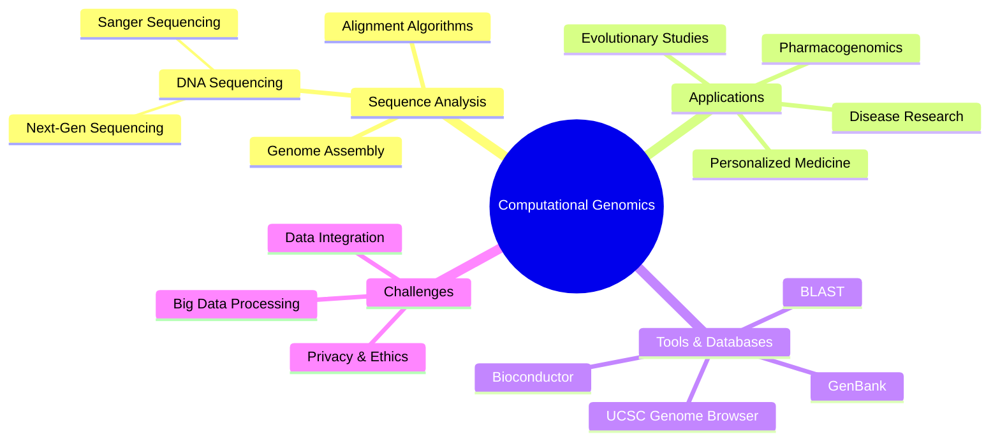

```mermaid
mindmap
  root((Computational Genomics))
    Sequence Analysis
      DNA Sequencing
        Next-Gen Sequencing
        Sanger Sequencing
      Genome Assembly
      Alignment Algorithms
    Applications
      Disease Research
      Personalized Medicine
      Evolutionary Studies
      Pharmacogenomics
    Tools & Databases
      BLAST
      GenBank
      UCSC Genome Browser
      Bioconductor
    Challenges
      Big Data Processing
      Data Integration
      Privacy & Ethics
```

