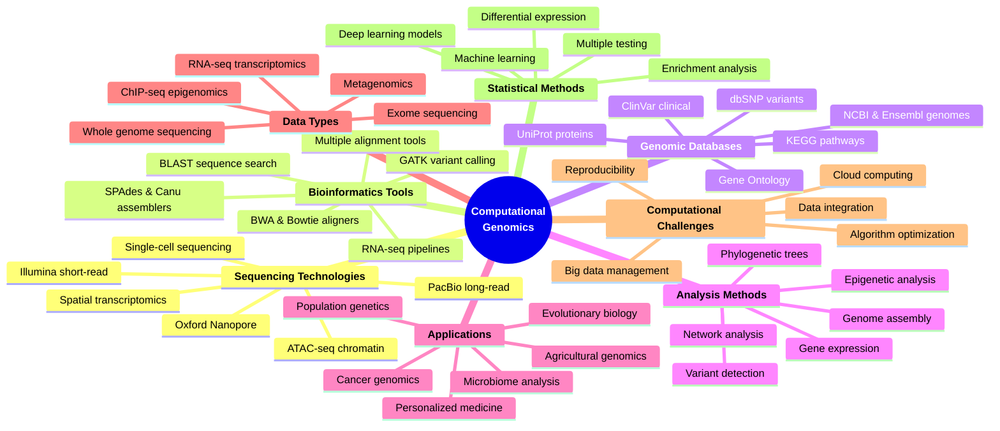

```mermaid
mindmap
  root((<b>Computational<br>Genomics</b>))
    <b>Sequencing Technologies</b>
      Illumina short-read
      PacBio long-read
      Oxford Nanopore
      Single-cell sequencing
      Spatial transcriptomics
      ATAC-seq chromatin
    <b>Bioinformatics Tools</b>
      BWA & Bowtie aligners
      SPAdes & Canu assemblers
      GATK variant calling
      RNA-seq pipelines
      BLAST sequence search
      Multiple alignment tools
    <b>Genomic Databases</b>
      NCBI & Ensembl genomes
      dbSNP variants
      ClinVar clinical
      Gene Ontology
      KEGG pathways
      UniProt proteins
    <b>Analysis Methods</b>
      Genome assembly
      Variant detection
      Gene expression
      Epigenetic analysis
      Phylogenetic trees
      Network analysis
    <b>Applications</b>
      Personalized medicine
      Cancer genomics
      Population genetics
      Agricultural genomics
      Microbiome analysis
      Evolutionary biology
    <b>Data Types</b>
      Whole genome sequencing
      Exome sequencing
      RNA-seq transcriptomics
      ChIP-seq epigenomics
      Metagenomics
    <b>Computational Challenges</b>
      Big data management
      Algorithm optimization
      Reproducibility
      Data integration
      Cloud computing
    <b>Statistical Methods</b>
      Differential expression
      Enrichment analysis
      Multiple testing
      Machine learning
      Deep learning models
```

