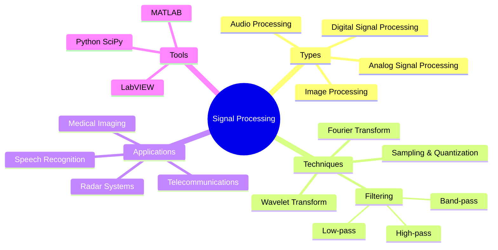

```mermaid
mindmap
  root((Signal Processing))
    Types
      Digital Signal Processing
      Analog Signal Processing
      Image Processing
      Audio Processing
    Techniques
      Filtering
        Low-pass
        High-pass
        Band-pass
      Fourier Transform
      Wavelet Transform
      Sampling & Quantization
    Applications
      Telecommunications
      Medical Imaging
      Radar Systems
      Speech Recognition
    Tools
      MATLAB
      Python SciPy
      LabVIEW
```

