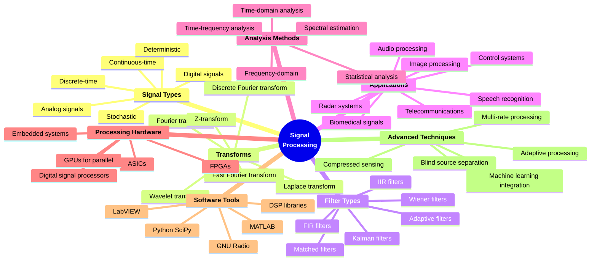

```mermaid
mindmap
  root((<b>Signal<br>Processing</b>))
    <b>Signal Types</b>
      Continuous-time
      Discrete-time
      Analog signals
      Digital signals
      Deterministic
      Stochastic
    <b>Transforms</b>
      Fourier transform
      Discrete Fourier transform
      Fast Fourier transform
      Wavelet transform
      Laplace transform
      Z-transform
    <b>Filter Types</b>
      FIR filters
      IIR filters
      Adaptive filters
      Matched filters
      Wiener filters
      Kalman filters
    <b>Applications</b>
      Telecommunications
      Audio processing
      Image processing
      Biomedical signals
      Radar systems
      Speech recognition
      Control systems
    <b>Analysis Methods</b>
      Time-domain analysis
      Frequency-domain
      Time-frequency analysis
      Statistical analysis
      Spectral estimation
    <b>Processing Hardware</b>
      Digital signal processors
      FPGAs
      ASICs
      GPUs for parallel
      Embedded systems
    <b>Software Tools</b>
      MATLAB
      Python SciPy
      GNU Radio
      LabVIEW
      DSP libraries
    <b>Advanced Techniques</b>
      Adaptive processing
      Multi-rate processing
      Compressed sensing
      Blind source separation
      Machine learning integration
```

