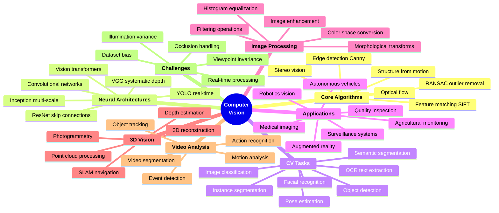

```mermaid
mindmap
  root((<b>Computer<br>Vision</b>))
    <b>Core Algorithms</b>
      Edge detection Canny
      Feature matching SIFT
      Optical flow
      Structure from motion
      Stereo vision
      RANSAC outlier removal
    <b>Neural Architectures</b>
      Convolutional networks
      ResNet skip connections
      VGG systematic depth
      Inception multi-scale
      YOLO real-time
      Vision transformers
    <b>CV Tasks</b>
      Image classification
      Object detection
      Semantic segmentation
      Instance segmentation
      Pose estimation
      Facial recognition
      OCR text extraction
    <b>Applications</b>
      Autonomous vehicles
      Medical imaging
      Surveillance systems
      Robotics vision
      Augmented reality
      Quality inspection
      Agricultural monitoring
    <b>Image Processing</b>
      Filtering operations
      Morphological transforms
      Histogram equalization
      Color space conversion
      Image enhancement
    <b>3D Vision</b>
      Depth estimation
      Point cloud processing
      3D reconstruction
      SLAM navigation
      Photogrammetry
    <b>Video Analysis</b>
      Action recognition
      Object tracking
      Video segmentation
      Motion analysis
      Event detection
    <b>Challenges</b>
      Occlusion handling
      Illumination variance
      Viewpoint invariance
      Real-time processing
      Dataset bias
```

