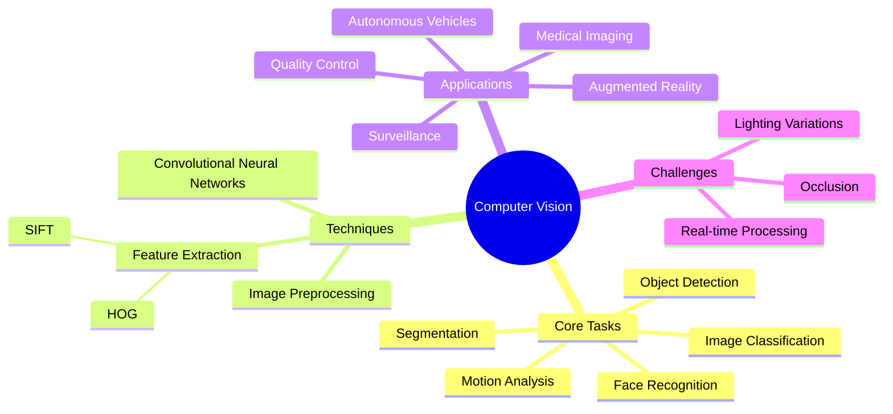

```mermaid
mindmap
  root((Computer Vision))
    Core Tasks
      Image Classification
      Object Detection
      Segmentation
      Face Recognition
      Motion Analysis
    Techniques
      Convolutional Neural Networks
      Feature Extraction
        SIFT
        HOG
      Image Preprocessing
    Applications
      Autonomous Vehicles
      Medical Imaging
      Surveillance
      Augmented Reality
      Quality Control
    Challenges
      Lighting Variations
      Occlusion
      Real-time Processing
```

