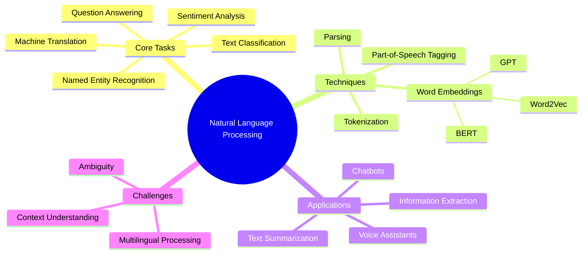

```mermaid
mindmap
  root((Natural Language Processing))
    Core Tasks
      Text Classification
      Named Entity Recognition
      Machine Translation
      Sentiment Analysis
      Question Answering
    Techniques
      Tokenization
      Part-of-Speech Tagging
      Parsing
      Word Embeddings
        Word2Vec
        BERT
        GPT
    Applications
      Chatbots
      Voice Assistants
      Information Extraction
      Text Summarization
    Challenges
      Ambiguity
      Context Understanding
      Multilingual Processing
```

