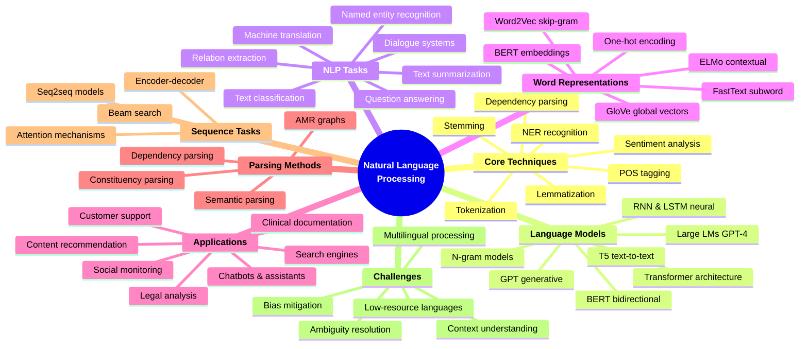

```mermaid
mindmap
  root((<b>Natural Language<br>Processing</b>))
    <b>Core Techniques</b>
      Tokenization
      Lemmatization
      Stemming
      POS tagging
      NER recognition
      Dependency parsing
      Sentiment analysis
    <b>Language Models</b>
      N-gram models
      RNN & LSTM neural
      Transformer architecture
      BERT bidirectional
      GPT generative
      T5 text-to-text
      Large LMs GPT-4
    <b>NLP Tasks</b>
      Text classification
      Machine translation
      Question answering
      Text summarization
      Named entity recognition
      Relation extraction
      Dialogue systems
    <b>Word Representations</b>
      One-hot encoding
      Word2Vec skip-gram
      GloVe global vectors
      FastText subword
      ELMo contextual
      BERT embeddings
    <b>Applications</b>
      Chatbots & assistants
      Search engines
      Content recommendation
      Customer support
      Clinical documentation
      Legal analysis
      Social monitoring
    <b>Parsing Methods</b>
      Constituency parsing
      Dependency parsing
      Semantic parsing
      AMR graphs
    <b>Sequence Tasks</b>
      Seq2seq models
      Attention mechanisms
      Encoder-decoder
      Beam search
    <b>Challenges</b>
      Ambiguity resolution
      Context understanding
      Multilingual processing
      Low-resource languages
      Bias mitigation
```

