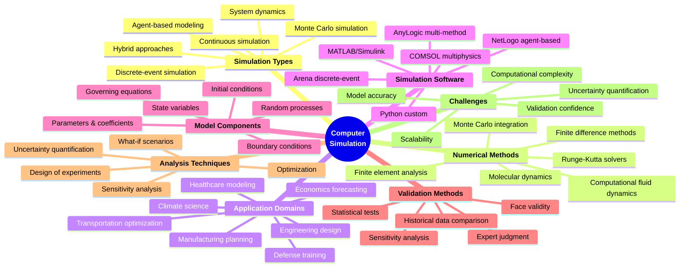

```mermaid
mindmap
  root((<b>Computer<br>Simulation</b>))
    <b>Simulation Types</b>
      Discrete-event simulation
      Continuous simulation
      Agent-based modeling
      System dynamics
      Monte Carlo simulation
      Hybrid approaches
    <b>Numerical Methods</b>
      Finite difference methods
      Finite element analysis
      Runge-Kutta solvers
      Monte Carlo integration
      Computational fluid dynamics
      Molecular dynamics
    <b>Application Domains</b>
      Engineering design
      Healthcare modeling
      Economics forecasting
      Climate science
      Transportation optimization
      Manufacturing planning
      Defense training
    <b>Simulation Software</b>
      MATLAB/Simulink
      AnyLogic multi-method
      Arena discrete-event
      NetLogo agent-based
      COMSOL multiphysics
      Python custom
    <b>Model Components</b>
      State variables
      Governing equations
      Boundary conditions
      Initial conditions
      Parameters & coefficients
      Random processes
    <b>Validation Methods</b>
      Historical data comparison
      Expert judgment
      Sensitivity analysis
      Face validity
      Statistical tests
    <b>Analysis Techniques</b>
      What-if scenarios
      Optimization
      Sensitivity analysis
      Uncertainty quantification
      Design of experiments
    <b>Challenges</b>
      Computational complexity
      Model accuracy
      Uncertainty quantification
      Validation confidence
      Scalability
```

