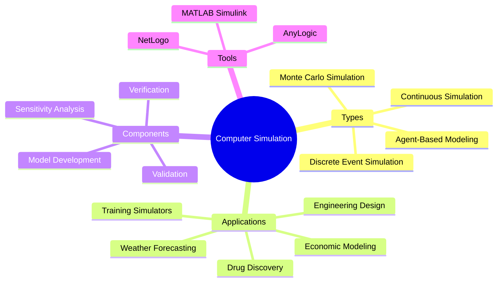

```mermaid
mindmap
  root((Computer Simulation))
    Types
      Discrete Event Simulation
      Continuous Simulation
      Agent-Based Modeling
      Monte Carlo Simulation
    Applications
      Weather Forecasting
      Engineering Design
      Economic Modeling
      Training Simulators
      Drug Discovery
    Components
      Model Development
      Validation
      Verification
      Sensitivity Analysis
    Tools
      MATLAB Simulink
      AnyLogic
      NetLogo
```

