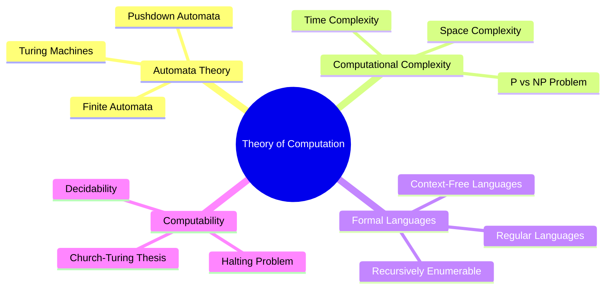

```mermaid
mindmap
  root((Theory of Computation))
    Automata Theory
      Finite Automata
      Pushdown Automata
      Turing Machines
    Computational Complexity
      P vs NP Problem
      Time Complexity
      Space Complexity
    Formal Languages
      Regular Languages
      Context-Free Languages
      Recursively Enumerable
    Computability
      Decidability
      Church-Turing Thesis
      Halting Problem
```

