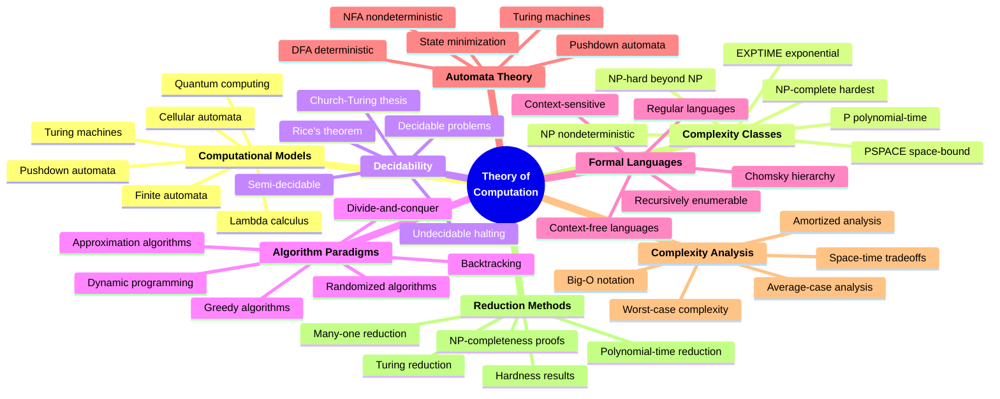

```mermaid
mindmap
  root((<b>Theory of<br>Computation</b>))
    <b>Computational Models</b>
      Turing machines
      Finite automata
      Pushdown automata
      Lambda calculus
      Cellular automata
      Quantum computing
    <b>Complexity Classes</b>
      P polynomial-time
      NP nondeterministic
      NP-complete hardest
      NP-hard beyond NP
      PSPACE space-bound
      EXPTIME exponential
    <b>Decidability</b>
      Decidable problems
      Undecidable halting
      Semi-decidable
      Church-Turing thesis
      Rice's theorem
    <b>Algorithm Paradigms</b>
      Divide-and-conquer
      Dynamic programming
      Greedy algorithms
      Backtracking
      Approximation algorithms
      Randomized algorithms
    <b>Formal Languages</b>
      Regular languages
      Context-free languages
      Context-sensitive
      Recursively enumerable
      Chomsky hierarchy
    <b>Automata Theory</b>
      DFA deterministic
      NFA nondeterministic
      Pushdown automata
      Turing machines
      State minimization
    <b>Complexity Analysis</b>
      Worst-case complexity
      Average-case analysis
      Amortized analysis
      Big-O notation
      Space-time tradeoffs
    <b>Reduction Methods</b>
      Polynomial-time reduction
      Many-one reduction
      Turing reduction
      NP-completeness proofs
      Hardness results
```

