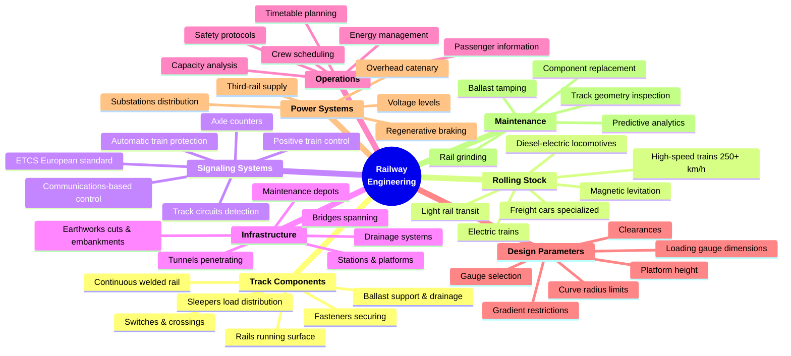

```mermaid
mindmap
  root((<b>Railway<br>Engineering</b>))
    <b>Track Components</b>
      Rails running surface
      Sleepers load distribution
      Ballast support & drainage
      Fasteners securing
      Switches & crossings
      Continuous welded rail
    <b>Rolling Stock</b>
      Diesel-electric locomotives
      Electric trains
      High-speed trains 250+ km/h
      Light rail transit
      Freight cars specialized
      Magnetic levitation
    <b>Signaling Systems</b>
      Track circuits detection
      Axle counters
      Automatic train protection
      Positive train control
      ETCS European standard
      Communications-based control
    <b>Infrastructure</b>
      Earthworks cuts & embankments
      Bridges spanning
      Tunnels penetrating
      Stations & platforms
      Maintenance depots
      Drainage systems
    <b>Operations</b>
      Timetable planning
      Capacity analysis
      Energy management
      Safety protocols
      Passenger information
      Crew scheduling
    <b>Design Parameters</b>
      Gauge selection
      Loading gauge dimensions
      Curve radius limits
      Gradient restrictions
      Platform height
      Clearances
    <b>Power Systems</b>
      Overhead catenary
      Third-rail supply
      Substations distribution
      Regenerative braking
      Voltage levels
    <b>Maintenance</b>
      Track geometry inspection
      Rail grinding
      Ballast tamping
      Component replacement
      Predictive analytics
```

