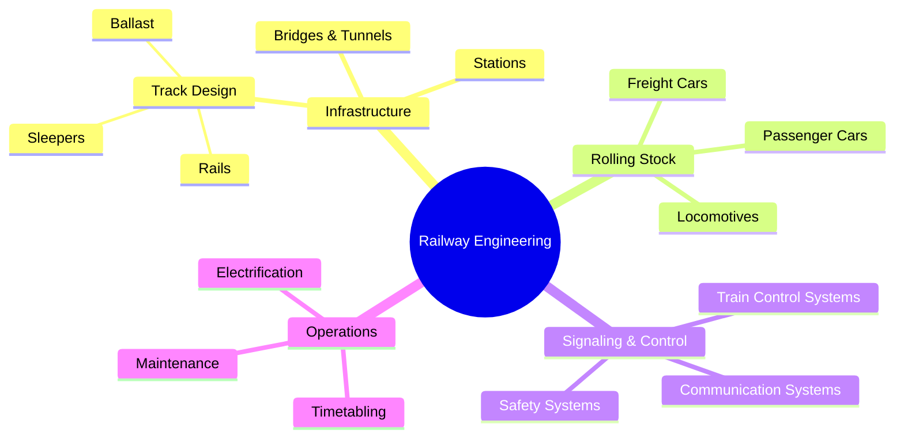

```mermaid
mindmap
  root((Railway Engineering))
    Infrastructure
      Track Design
        Rails
        Sleepers
        Ballast
      Bridges & Tunnels
      Stations
    Rolling Stock
      Locomotives
      Passenger Cars
      Freight Cars
    Signaling & Control
      Train Control Systems
      Communication Systems
      Safety Systems
    Operations
      Timetabling
      Maintenance
      Electrification
```

