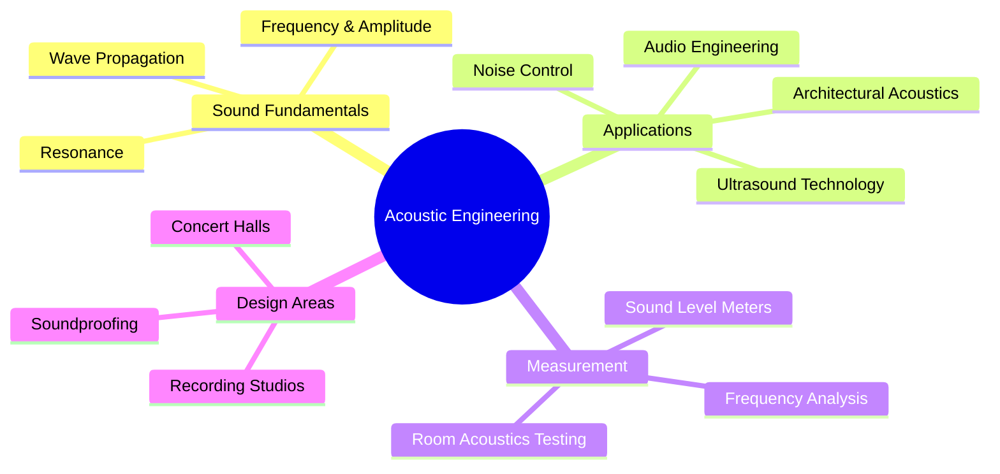

```mermaid
mindmap
  root((Acoustic Engineering))
    Sound Fundamentals
      Wave Propagation
      Frequency & Amplitude
      Resonance
    Applications
      Architectural Acoustics
      Audio Engineering
      Noise Control
      Ultrasound Technology
    Measurement
      Sound Level Meters
      Frequency Analysis
      Room Acoustics Testing
    Design Areas
      Concert Halls
      Recording Studios
      Soundproofing
```

