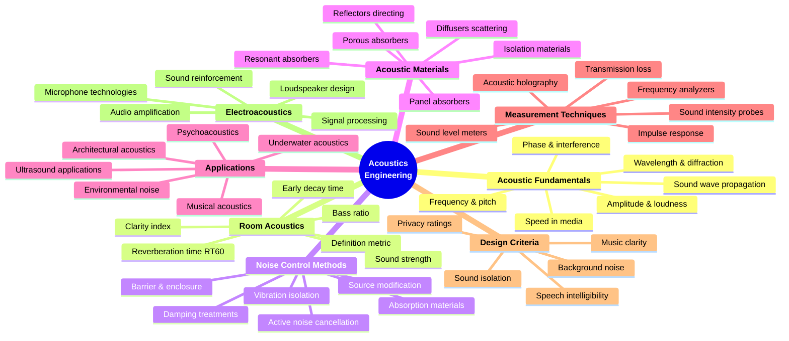

```mermaid
mindmap
  root((<b>Acoustics<br>Engineering</b>))
    <b>Acoustic Fundamentals</b>
      Sound wave propagation
      Frequency & pitch
      Wavelength & diffraction
      Amplitude & loudness
      Phase & interference
      Speed in media
    <b>Room Acoustics</b>
      Reverberation time RT60
      Early decay time
      Clarity index
      Definition metric
      Sound strength
      Bass ratio
    <b>Noise Control Methods</b>
      Source modification
      Barrier & enclosure
      Absorption materials
      Vibration isolation
      Active noise cancellation
      Damping treatments
    <b>Acoustic Materials</b>
      Porous absorbers
      Panel absorbers
      Resonant absorbers
      Diffusers scattering
      Reflectors directing
      Isolation materials
    <b>Applications</b>
      Architectural acoustics
      Environmental noise
      Underwater acoustics
      Musical acoustics
      Psychoacoustics
      Ultrasound applications
    <b>Measurement Techniques</b>
      Sound level meters
      Frequency analyzers
      Impulse response
      Sound intensity probes
      Acoustic holography
      Transmission loss
    <b>Design Criteria</b>
      Speech intelligibility
      Music clarity
      Background noise
      Privacy ratings
      Sound isolation
    <b>Electroacoustics</b>
      Microphone technologies
      Loudspeaker design
      Audio amplification
      Signal processing
      Sound reinforcement
```

