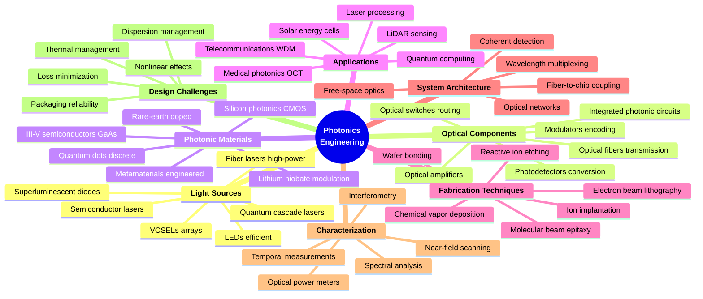

```mermaid
mindmap
  root((<b>Photonics<br>Engineering</b>))
    <b>Light Sources</b>
      Semiconductor lasers
      Fiber lasers high-power
      LEDs efficient
      VCSELs arrays
      Quantum cascade lasers
      Superluminescent diodes
    <b>Optical Components</b>
      Optical fibers transmission
      Integrated photonic circuits
      Optical amplifiers
      Modulators encoding
      Photodetectors conversion
      Optical switches routing
    <b>Photonic Materials</b>
      III-V semiconductors GaAs
      Silicon photonics CMOS
      Lithium niobate modulation
      Rare-earth doped
      Metamaterials engineered
      Quantum dots discrete
    <b>Applications</b>
      Telecommunications WDM
      Medical photonics OCT
      LiDAR sensing
      Solar energy cells
      Quantum computing
      Laser processing
    <b>Fabrication Techniques</b>
      Molecular beam epitaxy
      Chemical vapor deposition
      Electron beam lithography
      Wafer bonding
      Ion implantation
      Reactive ion etching
    <b>System Architecture</b>
      Wavelength multiplexing
      Coherent detection
      Free-space optics
      Fiber-to-chip coupling
      Optical networks
    <b>Characterization</b>
      Spectral analysis
      Temporal measurements
      Near-field scanning
      Optical power meters
      Interferometry
    <b>Design Challenges</b>
      Dispersion management
      Nonlinear effects
      Thermal management
      Packaging reliability
      Loss minimization
```

