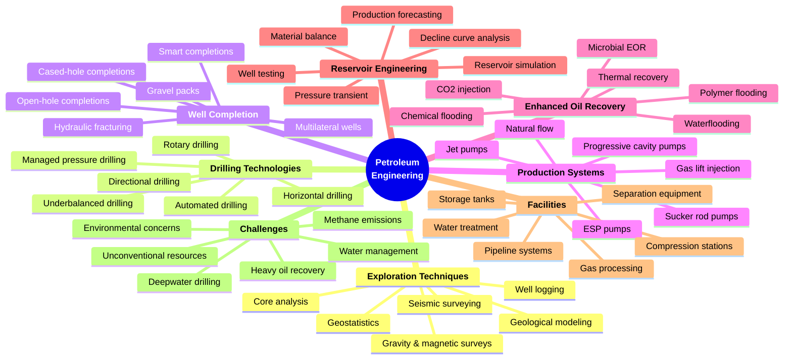

```mermaid
mindmap
  root((<b>Petroleum<br>Engineering</b>))
    <b>Exploration Techniques</b>
      Seismic surveying
      Gravity & magnetic surveys
      Well logging
      Core analysis
      Geological modeling
      Geostatistics
    <b>Drilling Technologies</b>
      Rotary drilling
      Directional drilling
      Horizontal drilling
      Underbalanced drilling
      Managed pressure drilling
      Automated drilling
    <b>Well Completion</b>
      Cased-hole completions
      Open-hole completions
      Gravel packs
      Hydraulic fracturing
      Multilateral wells
      Smart completions
    <b>Production Systems</b>
      Natural flow
      Gas lift injection
      ESP pumps
      Sucker rod pumps
      Progressive cavity pumps
      Jet pumps
    <b>Enhanced Oil Recovery</b>
      Waterflooding
      CO2 injection
      Thermal recovery
      Chemical flooding
      Microbial EOR
      Polymer flooding
    <b>Reservoir Engineering</b>
      Material balance
      Decline curve analysis
      Well testing
      Pressure transient
      Reservoir simulation
      Production forecasting
    <b>Facilities</b>
      Separation equipment
      Gas processing
      Water treatment
      Pipeline systems
      Storage tanks
      Compression stations
    <b>Challenges</b>
      Unconventional resources
      Deepwater drilling
      Heavy oil recovery
      Environmental concerns
      Water management
      Methane emissions
```

