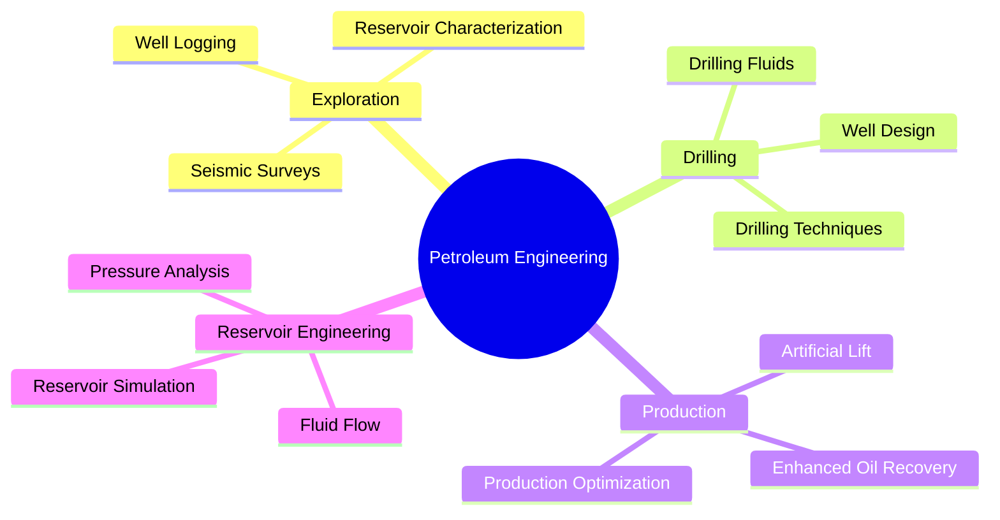

```mermaid
mindmap
  root((Petroleum Engineering))
    Exploration
      Seismic Surveys
      Well Logging
      Reservoir Characterization
    Drilling
      Drilling Techniques
      Well Design
      Drilling Fluids
    Production
      Enhanced Oil Recovery
      Artificial Lift
      Production Optimization
    Reservoir Engineering
      Fluid Flow
      Reservoir Simulation
      Pressure Analysis
```

