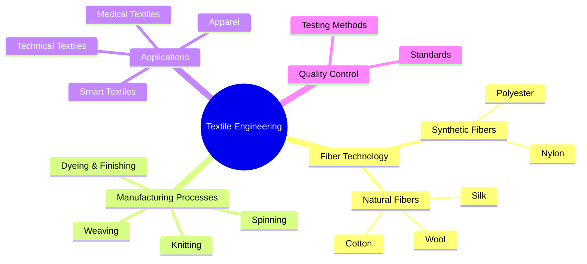

```mermaid
mindmap
  root((Textile Engineering))
    Fiber Technology
      Natural Fibers
        Cotton
        Wool
        Silk
      Synthetic Fibers
        Polyester
        Nylon
    Manufacturing Processes
      Spinning
      Weaving
      Knitting
      Dyeing & Finishing
    Applications
      Apparel
      Technical Textiles
      Smart Textiles
      Medical Textiles
    Quality Control
      Testing Methods
      Standards
```

