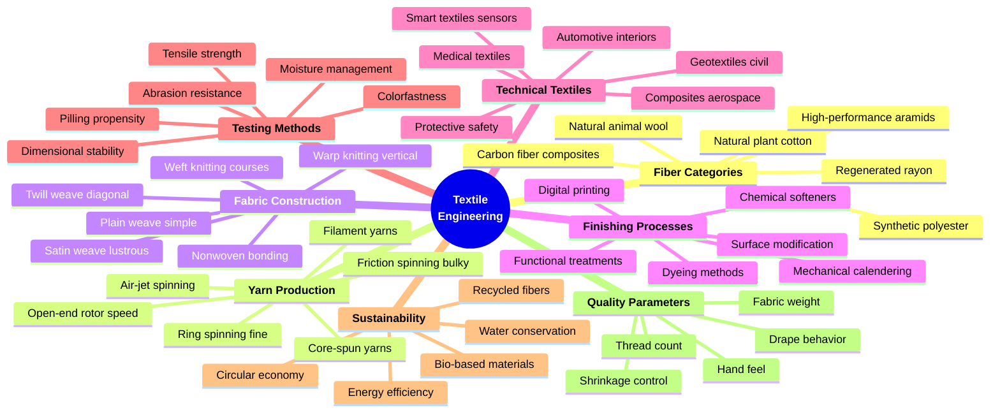

```mermaid
mindmap
  root((<b>Textile<br>Engineering</b>))
    <b>Fiber Categories</b>
      Natural plant cotton
      Natural animal wool
      Synthetic polyester
      Regenerated rayon
      High-performance aramids
      Carbon fiber composites
    <b>Yarn Production</b>
      Ring spinning fine
      Open-end rotor speed
      Air-jet spinning
      Friction spinning bulky
      Core-spun yarns
      Filament yarns
    <b>Fabric Construction</b>
      Plain weave simple
      Twill weave diagonal
      Satin weave lustrous
      Weft knitting courses
      Warp knitting vertical
      Nonwoven bonding
    <b>Finishing Processes</b>
      Mechanical calendering
      Chemical softeners
      Dyeing methods
      Digital printing
      Functional treatments
      Surface modification
    <b>Technical Textiles</b>
      Geotextiles civil
      Medical textiles
      Protective safety
      Automotive interiors
      Smart textiles sensors
      Composites aerospace
    <b>Testing Methods</b>
      Tensile strength
      Abrasion resistance
      Pilling propensity
      Colorfastness
      Dimensional stability
      Moisture management
    <b>Sustainability</b>
      Recycled fibers
      Bio-based materials
      Water conservation
      Energy efficiency
      Circular economy
    <b>Quality Parameters</b>
      Fabric weight
      Thread count
      Hand feel
      Drape behavior
      Shrinkage control
```

