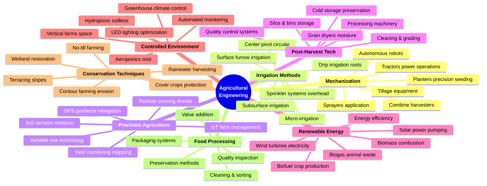

```mermaid
mindmap
  root((<b>Agricultural<br>Engineering</b>))
    <b>Mechanization</b>
      Tractors power operations
      Combine harvesters
      Planters precision seeding
      Sprayers application
      Autonomous robots
      Tillage equipment
    <b>Irrigation Methods</b>
      Surface furrow irrigation
      Sprinkler systems overhead
      Drip irrigation roots
      Center pivot circular
      Subsurface irrigation
      Micro-irrigation
    <b>Precision Agriculture</b>
      GPS guidance navigation
      Variable rate technology
      Remote sensing drones
      Yield monitoring mapping
      Soil sensors moisture
      IoT farm management
    <b>Post-Harvest Tech</b>
      Grain dryers moisture
      Silos & bins storage
      Cleaning & grading
      Cold storage preservation
      Processing machinery
      Quality control systems
    <b>Renewable Energy</b>
      Solar power pumping
      Biogas animal waste
      Biomass combustion
      Wind turbines electricity
      Biofuel crop production
      Energy efficiency
    <b>Controlled Environment</b>
      Greenhouse climate control
      Hydroponic soilless
      Vertical farms space
      LED lighting optimization
      Automated monitoring
      Aeroponics mist
    <b>Conservation Techniques</b>
      Contour farming erosion
      Terracing slopes
      Cover crops protection
      Wetland restoration
      Rainwater harvesting
      No-till farming
    <b>Food Processing</b>
      Cleaning & sorting
      Packaging systems
      Quality inspection
      Preservation methods
      Value addition
```

