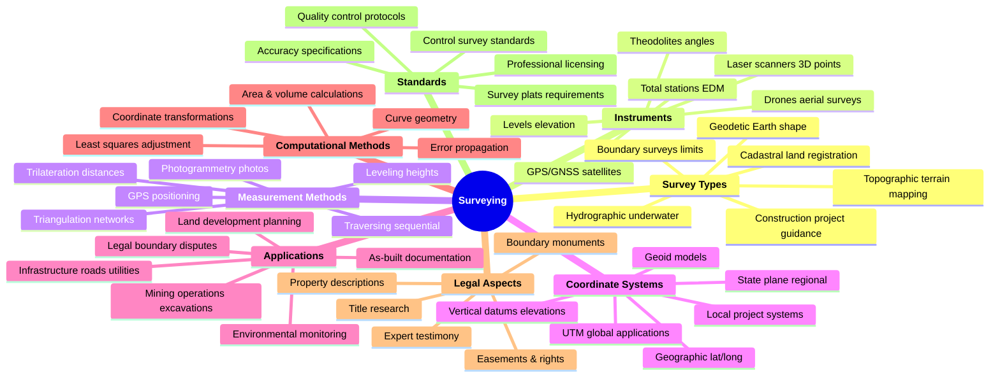

```mermaid
mindmap
  root((<b>Surveying</b>))
    <b>Survey Types</b>
      Boundary surveys limits
      Topographic terrain mapping
      Construction project guidance
      Geodetic Earth shape
      Hydrographic underwater
      Cadastral land registration
    <b>Instruments</b>
      Total stations EDM
      GPS/GNSS satellites
      Levels elevation
      Theodolites angles
      Laser scanners 3D points
      Drones aerial surveys
    <b>Measurement Methods</b>
      Traversing sequential
      Triangulation networks
      Trilateration distances
      Leveling heights
      GPS positioning
      Photogrammetry photos
    <b>Coordinate Systems</b>
      State plane regional
      UTM global applications
      Geographic lat/long
      Local project systems
      Vertical datums elevations
      Geoid models
    <b>Applications</b>
      Land development planning
      Infrastructure roads utilities
      Mining operations excavations
      Environmental monitoring
      Legal boundary disputes
      As-built documentation
    <b>Computational Methods</b>
      Least squares adjustment
      Coordinate transformations
      Error propagation
      Area & volume calculations
      Curve geometry
    <b>Legal Aspects</b>
      Property descriptions
      Easements & rights
      Boundary monuments
      Title research
      Expert testimony
    <b>Standards</b>
      Accuracy specifications
      Professional licensing
      Survey plats requirements
      Control survey standards
      Quality control protocols
```

