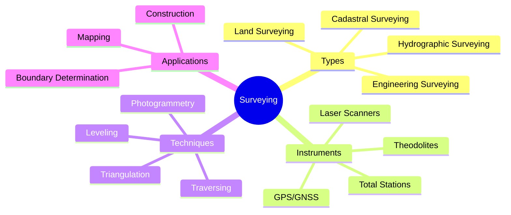

```mermaid
mindmap
  root((Surveying))
    Types
      Land Surveying
      Engineering Surveying
      Cadastral Surveying
      Hydrographic Surveying
    Instruments
      Total Stations
      GPS/GNSS
      Laser Scanners
      Theodolites
    Techniques
      Triangulation
      Traversing
      Leveling
      Photogrammetry
    Applications
      Construction
      Mapping
      Boundary Determination
```

