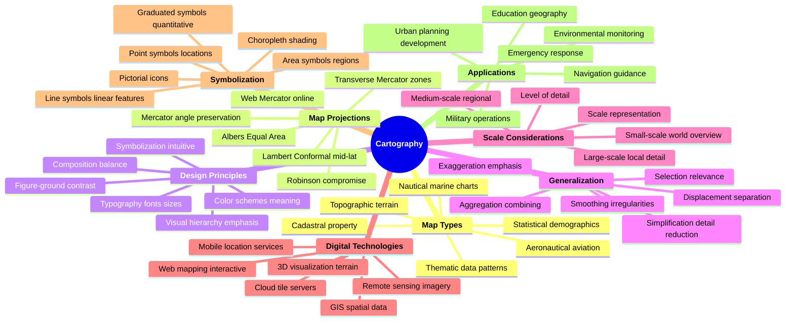

```mermaid
mindmap
  root((<b>Cartography</b>))
    <b>Map Types</b>
      Topographic terrain
      Thematic data patterns
      Nautical marine charts
      Aeronautical aviation
      Cadastral property
      Statistical demographics
    <b>Map Projections</b>
      Mercator angle preservation
      Transverse Mercator zones
      Lambert Conformal mid-lat
      Albers Equal Area
      Robinson compromise
      Web Mercator online
    <b>Design Principles</b>
      Visual hierarchy emphasis
      Color schemes meaning
      Typography fonts sizes
      Symbolization intuitive
      Composition balance
      Figure-ground contrast
    <b>Generalization</b>
      Selection relevance
      Simplification detail reduction
      Smoothing irregularities
      Aggregation combining
      Displacement separation
      Exaggeration emphasis
    <b>Scale Considerations</b>
      Large-scale local detail
      Medium-scale regional
      Small-scale world overview
      Scale representation
      Level of detail
    <b>Digital Technologies</b>
      GIS spatial data
      Remote sensing imagery
      Web mapping interactive
      3D visualization terrain
      Mobile location services
      Cloud tile servers
    <b>Symbolization</b>
      Point symbols locations
      Line symbols linear features
      Area symbols regions
      Pictorial icons
      Graduated symbols quantitative
      Choropleth shading
    <b>Applications</b>
      Navigation guidance
      Urban planning development
      Environmental monitoring
      Military operations
      Education geography
      Emergency response
```

