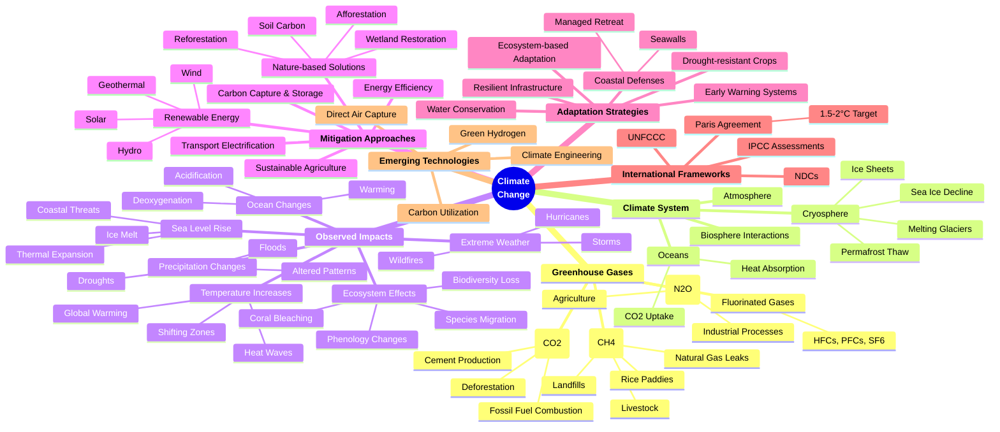

```mermaid
mindmap
  root((<b>Climate<br>Change</b>))
    <b>Greenhouse Gases</b>
      Carbon Dioxide (CO2)
        Fossil Fuel Combustion
        Deforestation
        Cement Production
      Methane (CH4)
        Livestock
        Rice Paddies
        Landfills
        Natural Gas Leaks
      Nitrous Oxide (N2O)
        Agriculture
        Industrial Processes
      Fluorinated Gases
        HFCs, PFCs, SF6
    <b>Climate System</b>
      Atmosphere
      Oceans
        Heat Absorption
        CO2 Uptake
      Cryosphere
        Melting Glaciers
        Ice Sheets
        Sea Ice Decline
        Permafrost Thaw
      Biosphere Interactions
    <b>Observed Impacts</b>
      Temperature Increases
        Global Warming
        Heat Waves
        Shifting Zones
      Precipitation Changes
        Altered Patterns
        Droughts
        Floods
      Sea Level Rise
        Thermal Expansion
        Ice Melt
        Coastal Threats
      Extreme Weather
        Hurricanes
        Wildfires
        Storms
      Ocean Changes
        Acidification
        Warming
        Deoxygenation
      Ecosystem Effects
        Species Migration
        Phenology Changes
        Coral Bleaching
        Biodiversity Loss
    <b>Mitigation Approaches</b>
      Renewable Energy
        Solar
        Wind
        Hydro
        Geothermal
      Energy Efficiency
      Transport Electrification
      Carbon Capture & Storage
      Nature-based Solutions
        Reforestation
        Afforestation
        Wetland Restoration
        Soil Carbon
      Sustainable Agriculture
    <b>Adaptation Strategies</b>
      Resilient Infrastructure
      Early Warning Systems
      Water Conservation
      Drought-resistant Crops
      Coastal Defenses
        Seawalls
        Managed Retreat
      Ecosystem-based Adaptation
    <b>International Frameworks</b>
      UNFCCC
      Paris Agreement
        1.5-2°C Target
      IPCC Assessments
      NDCs
    <b>Emerging Technologies</b>
      Direct Air Capture
      Green Hydrogen
      Carbon Utilization
      Climate Engineering
```

