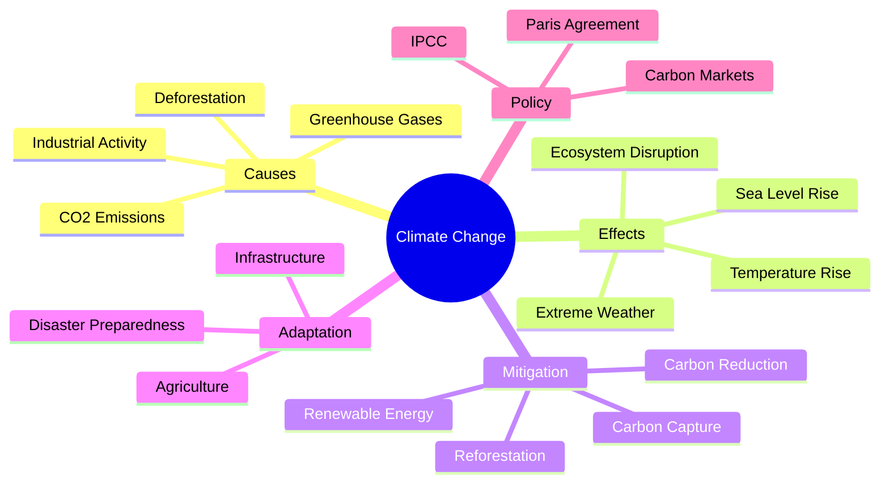

```mermaid
mindmap
  root((Climate Change))
    Causes
      Greenhouse Gases
      CO2 Emissions
      Deforestation
      Industrial Activity
    Effects
      Temperature Rise
      Sea Level Rise
      Extreme Weather
      Ecosystem Disruption
    Mitigation
      Carbon Reduction
      Renewable Energy
      Reforestation
      Carbon Capture
    Adaptation
      Infrastructure
      Agriculture
      Disaster Preparedness
    Policy
      Paris Agreement
      IPCC
      Carbon Markets
```

