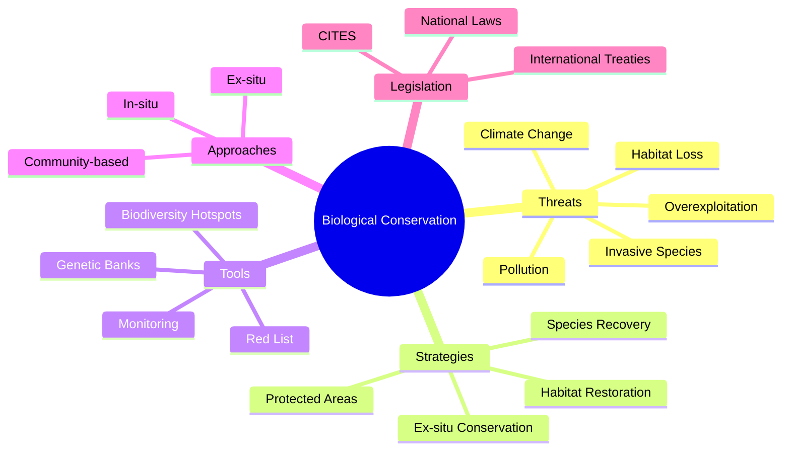

```mermaid
mindmap
  root((Biological Conservation))
    Threats
      Habitat Loss
      Overexploitation
      Pollution
      Invasive Species
      Climate Change
    Strategies
      Protected Areas
      Species Recovery
      Habitat Restoration
      Ex-situ Conservation
    Tools
      Biodiversity Hotspots
      Red List
      Genetic Banks
      Monitoring
    Approaches
      In-situ
      Ex-situ
      Community-based
    Legislation
      CITES
      National Laws
      International Treaties
```

