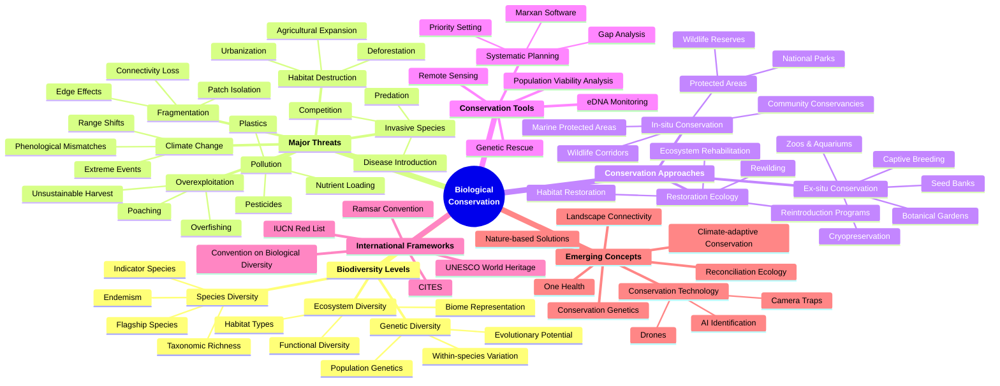

```mermaid
mindmap
  root((<b>Biological<br>Conservation</b>))
    <b>Biodiversity Levels</b>
      Genetic Diversity
        Within-species Variation
        Population Genetics
        Evolutionary Potential
      Species Diversity
        Taxonomic Richness
        Endemism
        Flagship Species
        Indicator Species
      Ecosystem Diversity
        Habitat Types
        Biome Representation
        Functional Diversity
    <b>Major Threats</b>
      Habitat Destruction
        Deforestation
        Urbanization
        Agricultural Expansion
      Fragmentation
        Patch Isolation
        Edge Effects
        Connectivity Loss
      Overexploitation
        Overfishing
        Poaching
        Unsustainable Harvest
      Invasive Species
        Competition
        Predation
        Disease Introduction
      Pollution
        Pesticides
        Plastics
        Nutrient Loading
      Climate Change
        Range Shifts
        Phenological Mismatches
        Extreme Events
    <b>Conservation Approaches</b>
      In-situ Conservation
        Protected Areas
          National Parks
          Wildlife Reserves
        Wildlife Corridors
        Marine Protected Areas
        Community Conservancies
      Ex-situ Conservation
        Zoos & Aquariums
        Botanical Gardens
        Seed Banks
        Captive Breeding
        Cryopreservation
      Restoration Ecology
        Habitat Restoration
        Reintroduction Programs
        Rewilding
        Ecosystem Rehabilitation
    <b>Conservation Tools</b>
      Systematic Planning
        Gap Analysis
        Priority Setting
        Marxan Software
      Population Viability Analysis
      Genetic Rescue
      eDNA Monitoring
      Remote Sensing
    <b>International Frameworks</b>
      IUCN Red List
      Convention on Biological Diversity
      CITES
      Ramsar Convention
      UNESCO World Heritage
    <b>Emerging Concepts</b>
      Conservation Genetics
      Landscape Connectivity
      Climate-adaptive Conservation
      Nature-based Solutions
      Reconciliation Ecology
      Conservation Technology
        Camera Traps
        Drones
        AI Identification
      One Health
```

