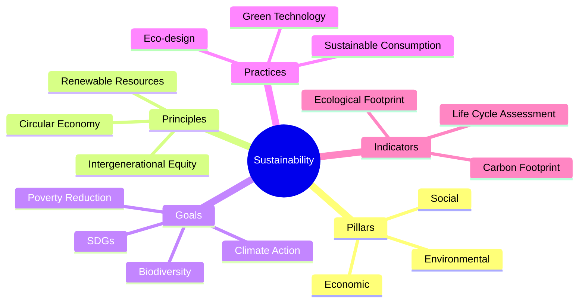

```mermaid
mindmap
  root((Sustainability))
    Pillars
      Environmental
      Economic
      Social
    Principles
      Renewable Resources
      Circular Economy
      Intergenerational Equity
    Goals
      SDGs
      Climate Action
      Biodiversity
      Poverty Reduction
    Practices
      Green Technology
      Sustainable Consumption
      Eco-design
    Indicators
      Ecological Footprint
      Carbon Footprint
      Life Cycle Assessment
```

