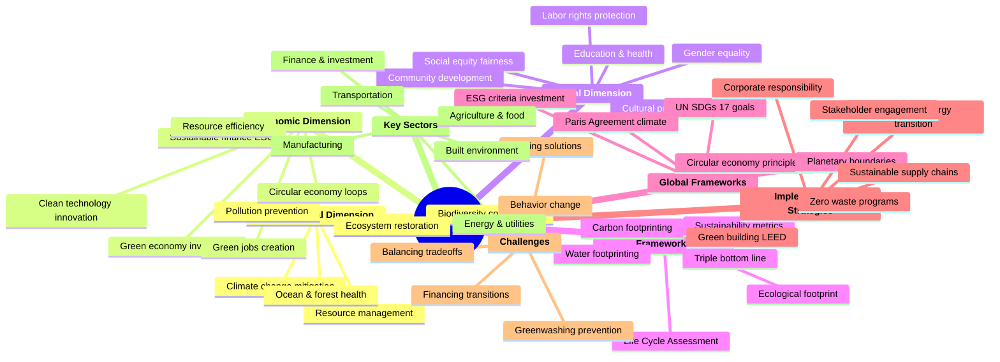

```mermaid
mindmap
  root((<b>Sustainability</b>))
    <b>Environmental Dimension</b>
      Climate change mitigation
      Biodiversity conservation
      Resource management
      Pollution prevention
      Ecosystem restoration
      Ocean & forest health
    <b>Economic Dimension</b>
      Circular economy loops
      Green economy investment
      Sustainable finance ESG
      Resource efficiency
      Clean technology innovation
      Green jobs creation
    <b>Social Dimension</b>
      Social equity fairness
      Community development
      Labor rights protection
      Education & health
      Cultural preservation
      Gender equality
    <b>Measurement Frameworks</b>
      Life Cycle Assessment
      Carbon footprinting
      Water footprinting
      Ecological footprint
      Triple bottom line
      Sustainability metrics
    <b>Global Frameworks</b>
      UN SDGs 17 goals
      Paris Agreement climate
      Circular economy principles
      ESG criteria investment
      Planetary boundaries
    <b>Implementation Strategies</b>
      Sustainable supply chains
      Green building LEED
      Renewable energy transition
      Zero waste programs
      Stakeholder engagement
      Corporate responsibility
    <b>Challenges</b>
      Greenwashing prevention
      Balancing tradeoffs
      Scaling solutions
      Financing transitions
      Behavior change
    <b>Key Sectors</b>
      Energy & utilities
      Agriculture & food
      Manufacturing
      Transportation
      Built environment
      Finance & investment
```

