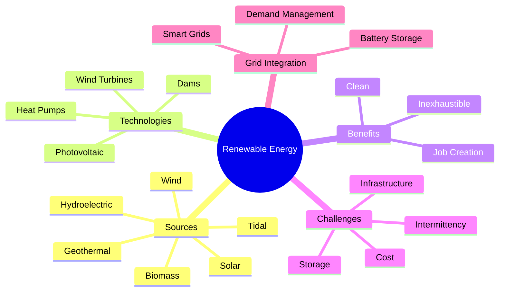

```mermaid
mindmap
  root((Renewable Energy))
    Sources
      Solar
      Wind
      Hydroelectric
      Geothermal
      Biomass
      Tidal
    Technologies
      Photovoltaic
      Wind Turbines
      Dams
      Heat Pumps
    Benefits
      Clean
      Inexhaustible
      Job Creation
    Challenges
      Intermittency
      Storage
      Infrastructure
      Cost
    Grid Integration
      Smart Grids
      Battery Storage
      Demand Management
```

