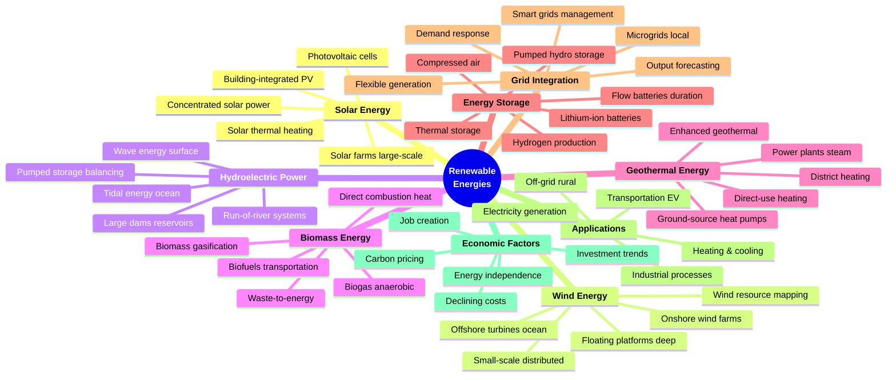

```mermaid
mindmap
  root((<b>Renewable<br>Energies</b>))
    <b>Solar Energy</b>
      Photovoltaic cells
      Concentrated solar power
      Building-integrated PV
      Solar thermal heating
      Solar farms large-scale
    <b>Wind Energy</b>
      Onshore wind farms
      Offshore turbines ocean
      Floating platforms deep
      Small-scale distributed
      Wind resource mapping
    <b>Hydroelectric Power</b>
      Large dams reservoirs
      Run-of-river systems
      Pumped storage balancing
      Tidal energy ocean
      Wave energy surface
    <b>Biomass Energy</b>
      Direct combustion heat
      Biogas anaerobic
      Biofuels transportation
      Biomass gasification
      Waste-to-energy
    <b>Geothermal Energy</b>
      Power plants steam
      Direct-use heating
      Ground-source heat pumps
      Enhanced geothermal
      District heating
    <b>Energy Storage</b>
      Lithium-ion batteries
      Flow batteries duration
      Pumped hydro storage
      Compressed air
      Thermal storage
      Hydrogen production
    <b>Grid Integration</b>
      Output forecasting
      Demand response
      Smart grids management
      Flexible generation
      Microgrids local
    <b>Applications</b>
      Electricity generation
      Heating & cooling
      Transportation EV
      Industrial processes
      Off-grid rural
    <b>Economic Factors</b>
      Declining costs
      Job creation
      Energy independence
      Carbon pricing
      Investment trends
```

