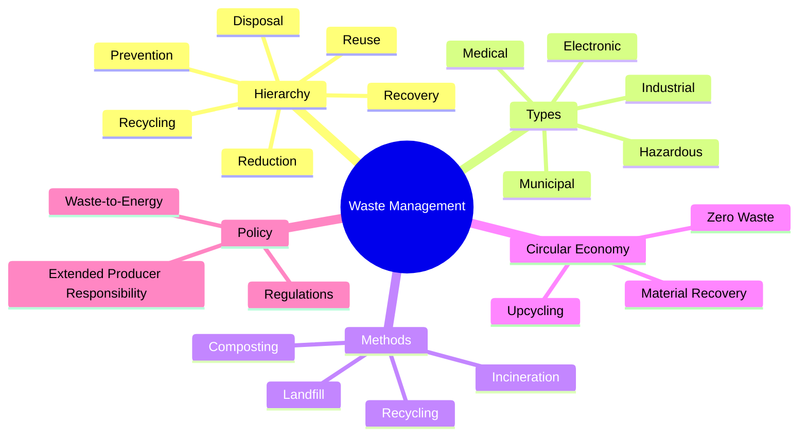

```mermaid
mindmap
  root((Waste Management))
    Hierarchy
      Prevention
      Reduction
      Reuse
      Recycling
      Recovery
      Disposal
    Types
      Municipal
      Industrial
      Hazardous
      Electronic
      Medical
    Methods
      Landfill
      Incineration
      Composting
      Recycling
    Circular Economy
      Material Recovery
      Upcycling
      Zero Waste
    Policy
      Regulations
      Extended Producer Responsibility
      Waste-to-Energy
```

