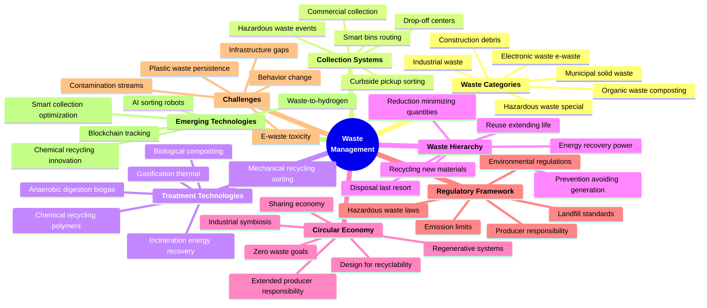

```mermaid
mindmap
  root((<b>Waste<br>Management</b>))
    <b>Waste Categories</b>
      Municipal solid waste
      Industrial waste
      Hazardous waste special
      Construction debris
      Electronic waste e-waste
      Organic waste composting
    <b>Collection Systems</b>
      Curbside pickup sorting
      Drop-off centers
      Commercial collection
      Hazardous waste events
      Smart bins routing
    <b>Treatment Technologies</b>
      Mechanical recycling sorting
      Biological composting
      Anaerobic digestion biogas
      Incineration energy recovery
      Gasification thermal
      Chemical recycling polymers
    <b>Waste Hierarchy</b>
      Prevention avoiding generation
      Reduction minimizing quantities
      Reuse extending life
      Recycling new materials
      Energy recovery power
      Disposal last resort
    <b>Circular Economy</b>
      Design for recyclability
      Industrial symbiosis
      Extended producer responsibility
      Sharing economy
      Regenerative systems
      Zero waste goals
    <b>Regulatory Framework</b>
      Environmental regulations
      Landfill standards
      Emission limits
      Hazardous waste laws
      Producer responsibility
    <b>Challenges</b>
      Contamination streams
      Plastic waste persistence
      E-waste toxicity
      Infrastructure gaps
      Behavior change
    <b>Emerging Technologies</b>
      AI sorting robots
      Chemical recycling innovation
      Waste-to-hydrogen
      Blockchain tracking
      Smart collection optimization
```

