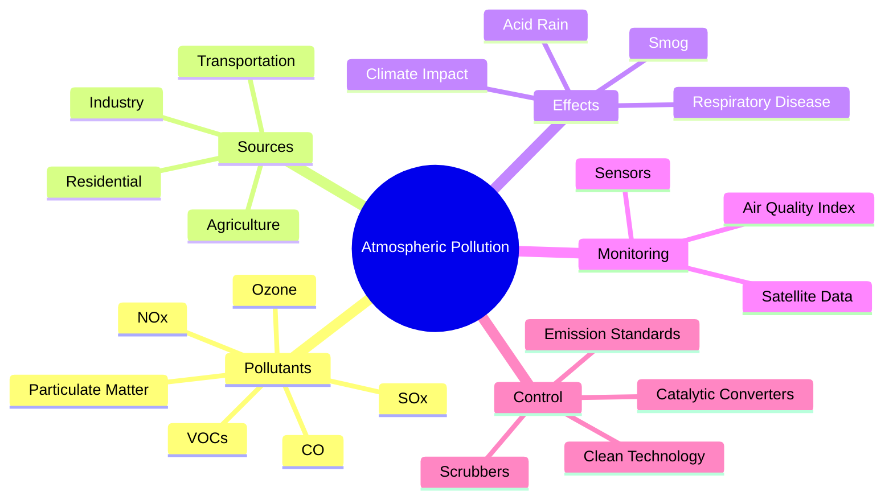

```mermaid
mindmap
  root((Atmospheric Pollution))
    Pollutants
      Particulate Matter
      NOx
      SOx
      CO
      Ozone
      VOCs
    Sources
      Industry
      Transportation
      Agriculture
      Residential
    Effects
      Respiratory Disease
      Acid Rain
      Smog
      Climate Impact
    Monitoring
      Air Quality Index
      Sensors
      Satellite Data
    Control
      Emission Standards
      Scrubbers
      Catalytic Converters
      Clean Technology
```

