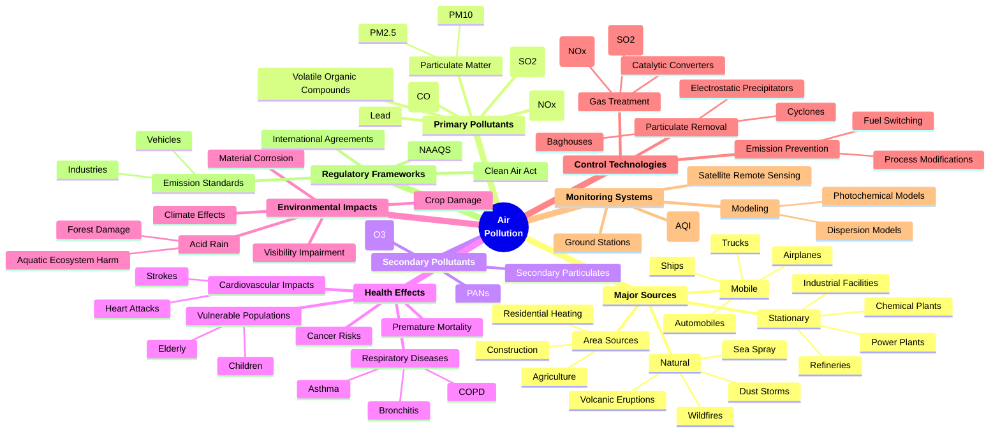

```mermaid
mindmap
  root((<b>Air<br>Pollution</b>))
    <b>Major Sources</b>
      Stationary
        Power Plants
        Industrial Facilities
        Refineries
        Chemical Plants
      Mobile
        Automobiles
        Trucks
        Airplanes
        Ships
      Area Sources
        Agriculture
        Construction
        Residential Heating
      Natural
        Volcanic Eruptions
        Wildfires
        Dust Storms
        Sea Spray
    <b>Primary Pollutants</b>
      Particulate Matter
        PM10
        PM2.5
      Nitrogen Oxides (NOx)
      Sulfur Dioxide (SO2)
      Carbon Monoxide (CO)
      Volatile Organic Compounds
      Lead
    <b>Secondary Pollutants</b>
      Ground-level Ozone (O3)
      Secondary Particulates
      PANs
    <b>Health Effects</b>
      Respiratory Diseases
        Asthma
        Bronchitis
        COPD
      Cardiovascular Impacts
        Heart Attacks
        Strokes
      Cancer Risks
      Premature Mortality
      Vulnerable Populations
        Children
        Elderly
    <b>Environmental Impacts</b>
      Acid Rain
        Forest Damage
        Aquatic Ecosystem Harm
      Visibility Impairment
      Crop Damage
      Material Corrosion
      Climate Effects
    <b>Control Technologies</b>
      Particulate Removal
        Electrostatic Precipitators
        Baghouses
        Cyclones
      Gas Treatment
        Scrubbers (SO2)
        Catalytic Converters
        SCR (NOx)
      Emission Prevention
        Fuel Switching
        Process Modifications
    <b>Monitoring Systems</b>
      Ground Stations
      Satellite Remote Sensing
      Air Quality Index (AQI)
      Modeling
        Dispersion Models
        Photochemical Models
    <b>Regulatory Frameworks</b>
      Clean Air Act
      NAAQS
      Emission Standards
        Vehicles
        Industries
      International Agreements
```

