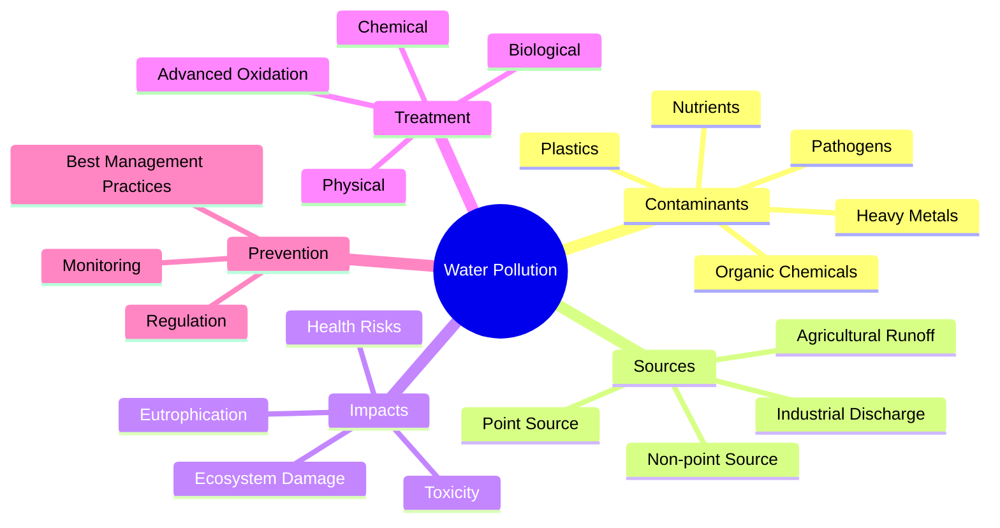

```mermaid
mindmap
  root((Water Pollution))
    Contaminants
      Nutrients
      Heavy Metals
      Pathogens
      Organic Chemicals
      Plastics
    Sources
      Point Source
      Non-point Source
      Agricultural Runoff
      Industrial Discharge
    Impacts
      Eutrophication
      Toxicity
      Ecosystem Damage
      Health Risks
    Treatment
      Physical
      Chemical
      Biological
      Advanced Oxidation
    Prevention
      Best Management Practices
      Regulation
      Monitoring
```

