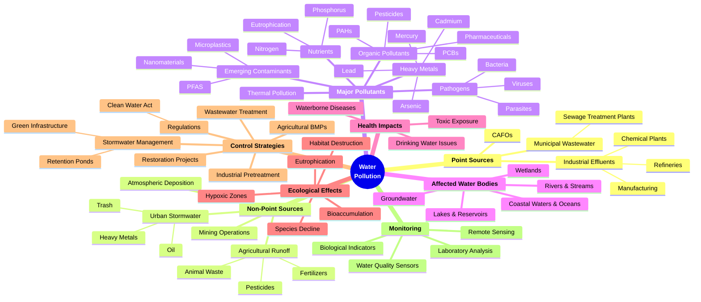

```mermaid
mindmap
  root((<b>Water<br>Pollution</b>))
    <b>Point Sources</b>
      Industrial Effluents
        Chemical Plants
        Refineries
        Manufacturing
      Municipal Wastewater
        Sewage Treatment Plants
      CAFOs
    <b>Non-Point Sources</b>
      Agricultural Runoff
        Fertilizers
        Pesticides
        Animal Waste
      Urban Stormwater
        Oil
        Heavy Metals
        Trash
      Atmospheric Deposition
      Mining Operations
    <b>Major Pollutants</b>
      Nutrients
        Nitrogen
        Phosphorus
        Eutrophication
      Heavy Metals
        Lead
        Mercury
        Cadmium
        Arsenic
      Organic Pollutants
        Pesticides
        Pharmaceuticals
        PCBs
        PAHs
      Pathogens
        Bacteria
        Viruses
        Parasites
      Thermal Pollution
      Emerging Contaminants
        Microplastics
        PFAS
        Nanomaterials
    <b>Affected Water Bodies</b>
      Rivers & Streams
      Lakes & Reservoirs
      Coastal Waters & Oceans
      Groundwater
      Wetlands
    <b>Health Impacts</b>
      Waterborne Diseases
      Toxic Exposure
      Drinking Water Issues
    <b>Ecological Effects</b>
      Eutrophication
      Hypoxic Zones
      Bioaccumulation
      Habitat Destruction
      Species Decline
    <b>Control Strategies</b>
      Wastewater Treatment
      Stormwater Management
        Green Infrastructure
        Retention Ponds
      Agricultural BMPs
      Industrial Pretreatment
      Regulations
        Clean Water Act
      Restoration Projects
    <b>Monitoring</b>
      Water Quality Sensors
      Laboratory Analysis
      Biological Indicators
      Remote Sensing
```

