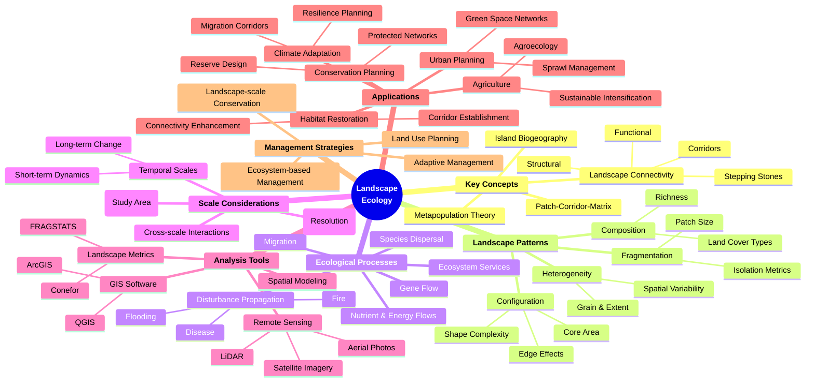

```mermaid
mindmap
  root((<b>Landscape<br>Ecology</b>))
    <b>Key Concepts</b>
      Patch-Corridor-Matrix
      Metapopulation Theory
      Island Biogeography
      Landscape Connectivity
        Structural
        Functional
        Corridors
        Stepping Stones
    <b>Landscape Patterns</b>
      Composition
        Land Cover Types
        Richness
      Configuration
        Shape Complexity
        Edge Effects
        Core Area
      Heterogeneity
        Spatial Variability
        Grain & Extent
      Fragmentation
        Patch Size
        Isolation Metrics
    <b>Ecological Processes</b>
      Species Dispersal
      Migration
      Gene Flow
      Disturbance Propagation
        Fire
        Flooding
        Disease
      Nutrient & Energy Flows
      Ecosystem Services
    <b>Scale Considerations</b>
      Grain (Resolution)
      Extent (Study Area)
      Temporal Scales
        Short-term Dynamics
        Long-term Change
      Cross-scale Interactions
    <b>Analysis Tools</b>
      GIS Software
        ArcGIS
        QGIS
      Remote Sensing
        Satellite Imagery
        Aerial Photos
        LiDAR
      Landscape Metrics
        FRAGSTATS
        Conefor
      Spatial Modeling
    <b>Applications</b>
      Conservation Planning
        Reserve Design
        Protected Networks
      Habitat Restoration
        Corridor Establishment
        Connectivity Enhancement
      Urban Planning
        Green Space Networks
        Sprawl Management
      Agriculture
        Agroecology
        Sustainable Intensification
      Climate Adaptation
        Migration Corridors
        Resilience Planning
    <b>Management Strategies</b>
      Landscape-scale Conservation
      Ecosystem-based Management
      Land Use Planning
      Adaptive Management
```

