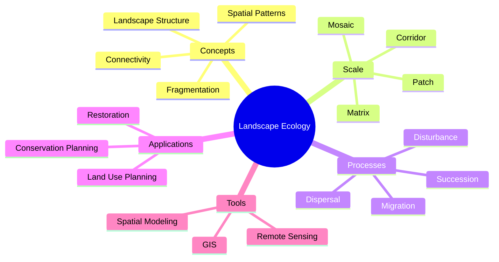

```mermaid
mindmap
  root((Landscape Ecology))
    Concepts
      Spatial Patterns
      Landscape Structure
      Connectivity
      Fragmentation
    Scale
      Patch
      Corridor
      Matrix
      Mosaic
    Processes
      Dispersal
      Migration
      Disturbance
      Succession
    Applications
      Conservation Planning
      Land Use Planning
      Restoration
    Tools
      GIS
      Remote Sensing
      Spatial Modeling
```

