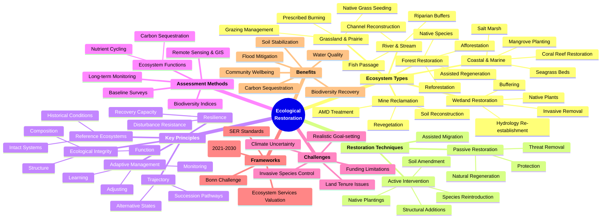

```mermaid
mindmap
  root((<b>Ecological<br>Restoration</b>))
    <b>Ecosystem Types</b>
      Forest Restoration
        Reforestation
        Afforestation
        Native Species
        Assisted Regeneration
      Wetland Restoration
        Hydrology Re-establishment
        Native Plants
        Invasive Removal
        Buffering
      Grassland & Prairie
        Native Grass Seeding
        Prescribed Burning
        Grazing Management
      River & Stream
        Channel Reconstruction
        Riparian Buffers
        Fish Passage
      Coastal & Marine
        Mangrove Planting
        Coral Reef Restoration
        Seagrass Beds
        Salt Marsh
      Mine Reclamation
        Soil Reconstruction
        Revegetation
        AMD Treatment
    <b>Restoration Techniques</b>
      Passive Restoration
        Natural Regeneration
        Threat Removal
        Protection
      Active Intervention
        Soil Amendment
        Native Plantings
        Species Reintroduction
        Structural Additions
      Assisted Migration
    <b>Key Principles</b>
      Reference Ecosystems
        Historical Conditions
        Intact Systems
      Ecological Integrity
        Structure
        Composition
        Function
      Resilience
        Disturbance Resistance
        Recovery Capacity
      Trajectory
        Succession Pathways
        Alternative States
      Adaptive Management
        Monitoring
        Learning
        Adjusting
    <b>Assessment Methods</b>
      Baseline Surveys
      Biodiversity Indices
      Ecosystem Functions
        Nutrient Cycling
        Carbon Sequestration
      Remote Sensing & GIS
      Long-term Monitoring
    <b>Challenges</b>
      Invasive Species Control
      Climate Uncertainty
      Funding Limitations
      Land Tenure Issues
      Realistic Goal-setting
    <b>Frameworks</b>
      SER Standards
      UN Decade (2021-2030)
      Bonn Challenge
      Ecosystem Services Valuation
    <b>Benefits</b>
      Biodiversity Recovery
      Carbon Sequestration
      Water Quality
      Flood Mitigation
      Soil Stabilization
      Community Wellbeing
```

